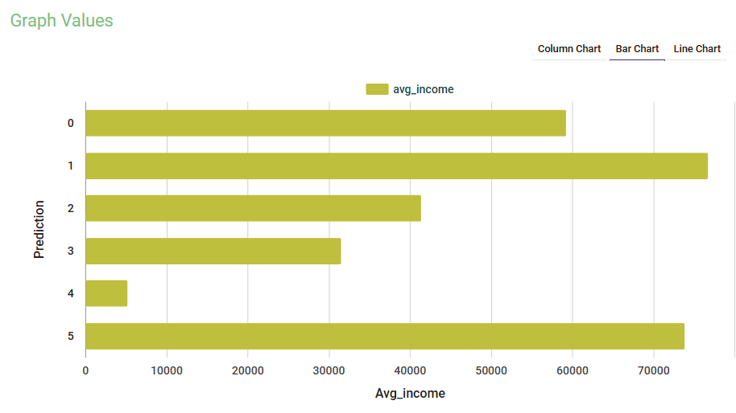
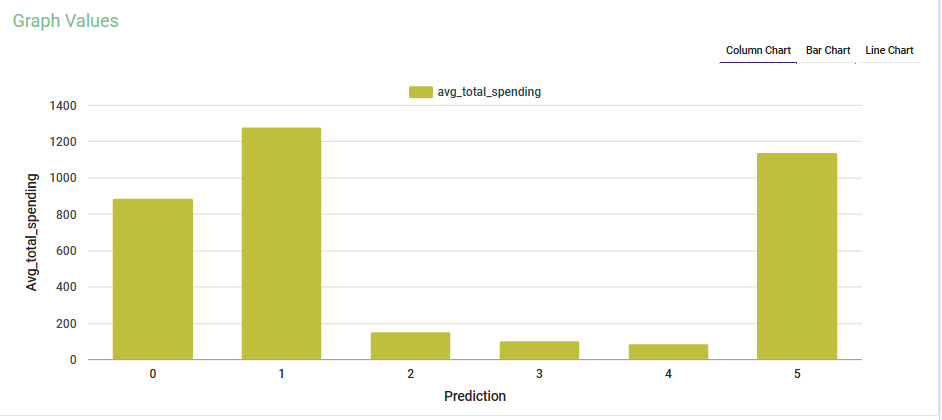
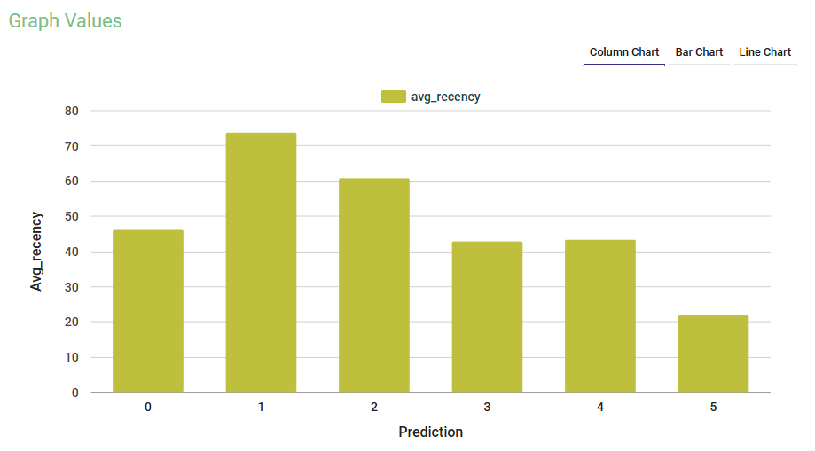
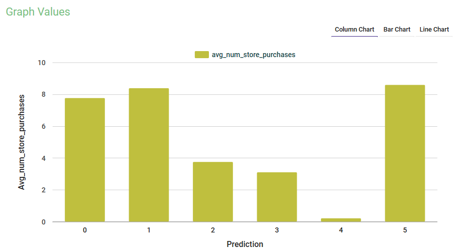
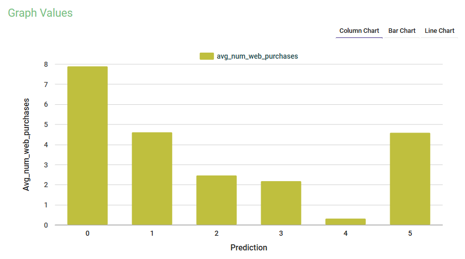
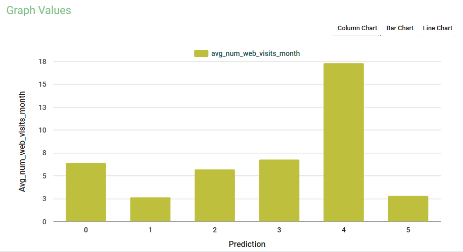

# 🧩 Sparkflows Customer Segmentation

Unsupervised **Customer Segmentation** project built on **Sparkflows**, using SQL-based **feature engineering**, **K-Means clustering**, and **business persona identification** to support data-driven marketing and customer analytics.

---

## 📖 Project Overview

This project was developed during my **AI Internship at Treomind** as part of my work in the **AI Department**.  
It demonstrates how to use **Sparkflows**, a low-code data science platform, to perform **feature engineering, clustering, and actionable business analysis**.

The main goal was to **segment retail customers** based on spending, recency, and engagement behavior — and then translate those clusters into **real-world business actions**.

---

## 🧠 Key Objectives

- Perform **feature engineering** using SQL Transformer nodes in Sparkflows.  
- Create new meaningful features:
  - `Age` → derived from `Year_Birth`  
  - `Total_Children` → sum of `Kidhome + Teenhome`  
  - `Total_Spending` → sum of all product category spendings  
  - `Customer_Since` → days since joining  
- Train a **K-Means clustering model** (K=6) to identify customer groups.  
- Evaluate clusters using **Silhouette Score (0.2865)**.  
- Visualize and interpret **cluster KPIs** using Group By + Graph Values nodes.  
- Generate **marketing personas and business strategies** for each cluster.

---

## ⚙️ Workflows Included

| Workflow | Purpose |
|-----------|----------|
| **1️⃣ Feature Engineering** | Clean and transform raw data, derive features like Age, Total_Spending, Tenure |
| **2️⃣ K-Means Modeling** | Scale features, assemble vectors, and train clustering model |
| **3️⃣ Cluster Analysis** | Compute averages, visualize KPIs, and extract business insights |

---

## 📊 Results Summary

| Metric | Value | Interpretation |
|--------|--------|----------------|
| **Clusters (K)** | 6 | Balanced segmentation |
| **Silhouette Score** | 0.2865 | Moderate separation, realistic for behavioral data |
| **Features Used** | 7 | Income, Age, Total_Spending, Purchases, Visits, Recency |

---

## 🖼️ Workflow Visuals

  
  

  
   
  <em>Workflows covering feature engineering, clustering, and business insight generation.</em>

---

## 📈 Cluster Visuals & KPIs

Below are examples of **per-cluster averages and behavioral metrics** generated during the segmentation analysis 👇  

  
  

  
  

  
  

   
  <em>Average income, spending, recency, and channel engagement by cluster.</em>

---

## 💼 Business Insights & Personas

This project extends beyond modeling — it delivers **business value** through **cluster personas** and **targeted marketing actions**.

### 🧩 Cluster Personas

| Cluster | Persona | Summary |
|----------|----------|----------|
| **1** | 🏦 High-Income Lapsed Spenders | Wealthy but inactive users — reactivate with personalized offers and store events. |
| **5** | 👑 VIP Store Loyalists | High-income, high-spend customers — maintain with VIP perks and early access. |
| **0** | 💻 Digital Power Users | Online-savvy, mid-spend users — scale growth via personalized web promotions. |
| **3** | 🛒 Mass Active Value Seekers | Largest segment — frequent buyers, low spend; boost with bundles and cross-sells. |
| **2** | 🧍 Low-Spend Occasional Shoppers | Price-sensitive and inactive — use low-risk trials and onboarding campaigns. |
| **4** | ⚠️ Heavy Browsers / Almost No Orders | Potential UX or payment issues — investigate individually. |

---

### 📊 Key Business Takeaways

- **Retention:** Protect top-value clusters (C1, C5) through loyalty and reactivation programs.  
- **Growth:** Focus digital marketing efforts on C0 (web-active users).  
- **Optimization:** Use pricing and cross-sell tactics for C3 (mass segment).  
- **Friction Reduction:** Simplify experience for C2 and fix potential UX bugs for C4.  

> These insights come from a data-driven analysis of average income, spending, recency, and channel engagement per cluster.  
> Full details are documented in [`Customer_Segmentation_Sparkflows_Documentation.pdf`](./Customer_Segmentation_Sparkflows_Documentation.pdf)

---

## 🧩 Tech Stack

- **Sparkflows** – Low-code AI/ML workflow platform  
- **Apache Spark** – Distributed backend  
- **SQL Transformers** – Feature engineering  
- **K-Means Clustering** – Unsupervised learning  
- **Group By / Graph Values Nodes** – Visualization & business insights  

---

## 🧾 Documentation

Full documentation available in  
[`docs/Customer_Segmentation_Sparkflows_Documentation.pdf`](./docs/Customer_Segmentation_Sparkflows_Documentation.pdf)

It includes:
- Node configurations  
- Workflow logic  
- Feature engineering details  
- Evaluation metrics  
- Persona creation and business insights  

---

## 🧑‍💻 Author

**Kutay Demir**  
AI & Data Science Intern @ Treomind  
🎓 Computer Engineering Student, MEF University  
🌐 [GitHub Profile](https://github.com/kutaydemir462)

---

## 🏷️ Keywords

`Sparkflows` • `Customer Segmentation` • `K-Means` • `Clustering` • `Feature Engineering` • `SQL Transformers` • `Marketing Analytics` • `Data Science` • `AI Internship`

---

⭐ **If you found this project insightful, consider giving it a star — it helps others discover practical Sparkflows machine learning workflows.**

